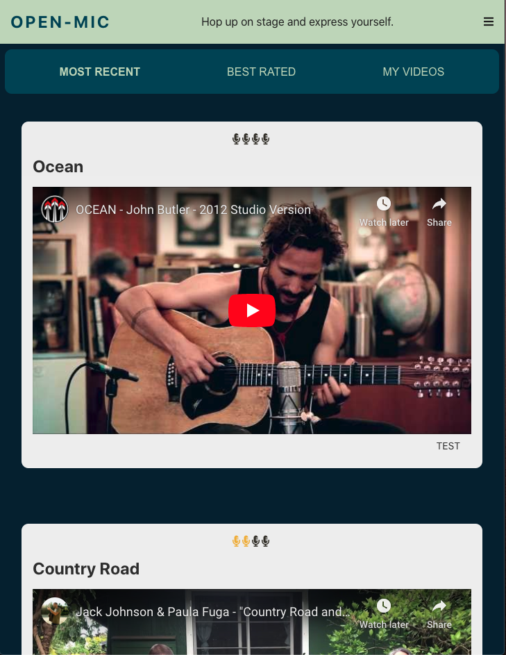

**OPEN-MIC: App for sharing your musical performances through external video links**

Live Website: https://open-mic.now.sh/

__SETTING UP__

- Install dependencies: npm install
- Create development and test databases: `createdb open-mic`, `createdb open-mic-test`
- Create database user: `createuser postgres`
- Grant privileges to new user in psql:  
  - `GRANT ALL PRIVILEGES ON DATABASE open-mic TO postgres`
  - `GRANT ALL PRIVILEGES ON DATABASE "open-mic-test" TO postgres`
- Prepare environment file: `cp example.env .env`
- Replace values in `.env` with your custom values.
- Bootstrap development database: `npm run migrate`
- Bootstrap test database: `npm run migrate:test`

__Configuring Postgres__

For tests involving time to run properly, your Postgres database must be configured to run in the UTC timezone.
  1. Locate the postgresql.conf file for your Postgres installation
    - OS X, Homebrew: /usr/local/var/postgres/postgresql.conf
  2. Uncomment the timezone line and set it to UTC as follows:  
  ` - Locale and Formatting - `  

      `datestyle = 'iso, mdy'`
      `#intervalstyle = 'postgres'`
      `timezone = 'UTC'`
      `#timezone_abbreviations = 'Default'  #Select the set of available time zone`

__Sample Data__

- To seed the database for development: `psql -U open_mic -d open-mic -f ./seeds/seed.openmic_tables.sql`

__Scripts__

- Start application for development: `npm run dev`
- Run tests: `npm test`

A summary section. This should have a concise explanation of what your app does. Try to frame this from the standpoint of what the user does, or what the app enables for the user.

1. **Landing Page:**   
Here on the landing page the user has the options of logging in, creating an account or watching videos as an anonymous user. The user also can experience the app as an authorized user by using the demo account provided within the page description.   

2. **Login Page:**   
The login page consists of a form for users to enter their username and password.  

3. **Register Page:**   
The register for account page is a form that the user submits to register for an account with OPEN-MIC. All fields are required except for email.  

4. **Unauthorized User Home Page:**   
An anonymous user can still watch videos that have been posted to OPEN-MIC. They are able to sort the videos by 'Most Recent' or 'Best Rated' but are asked to create an account when they select 'My Videos'. All other functionality has been removed from their home page.  
    

5. **Authorized User Home Page:**   
Here we see the full functionality of a users home page. They can see the last two comments on the video, comment themselves on a video, rate a video and have a working 'My Videos' tab.   

6. **Authorized User My Videos Tab**   
The 'My Videos' tab for authorized users give them the ability to update their title and description of the videos they have posted. They also have the ability to delete the videos they have shared.

7. **Hamburger Menu in Nav** 
Unauthorized User Expanded Hamburger Menu:  
  
Authorized User Hamburger Menu:  
  

__Technology Used__ 

- Javascript  
- HTML  
- CSS  
- React  
- Express  
- PostgreSQL  
- DBeaver  
- Heroku  
- Heroku Database
- Vercel  
- npm  

